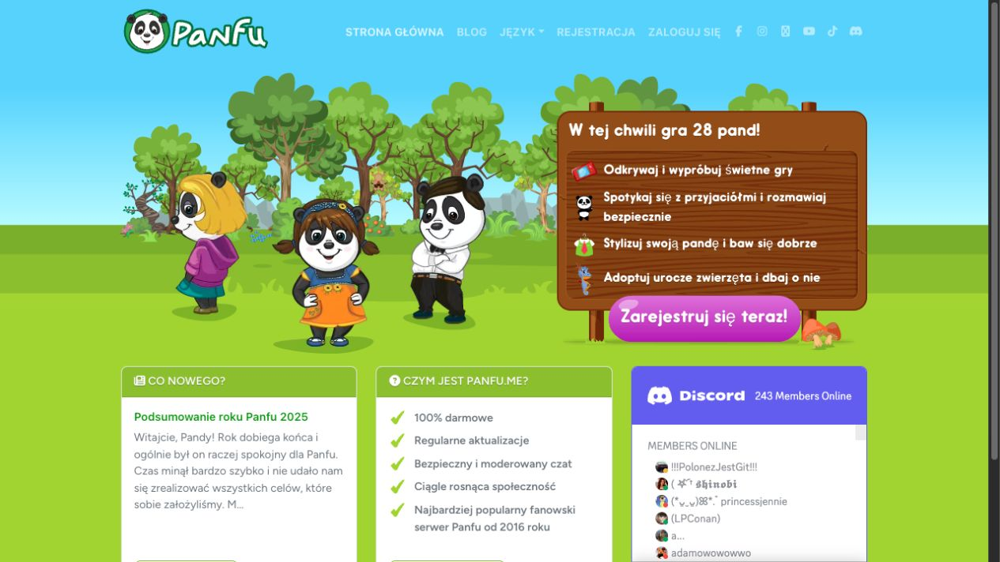
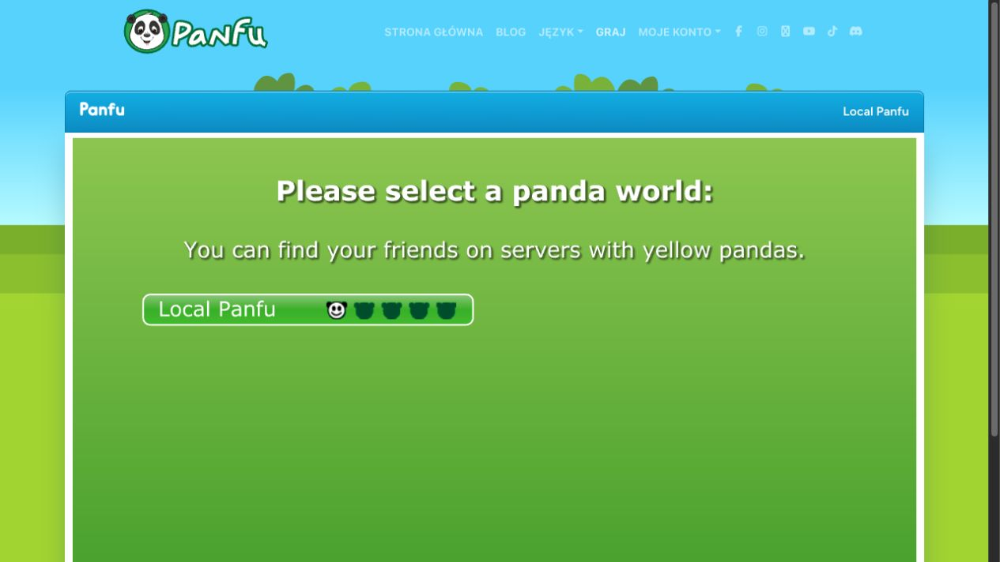
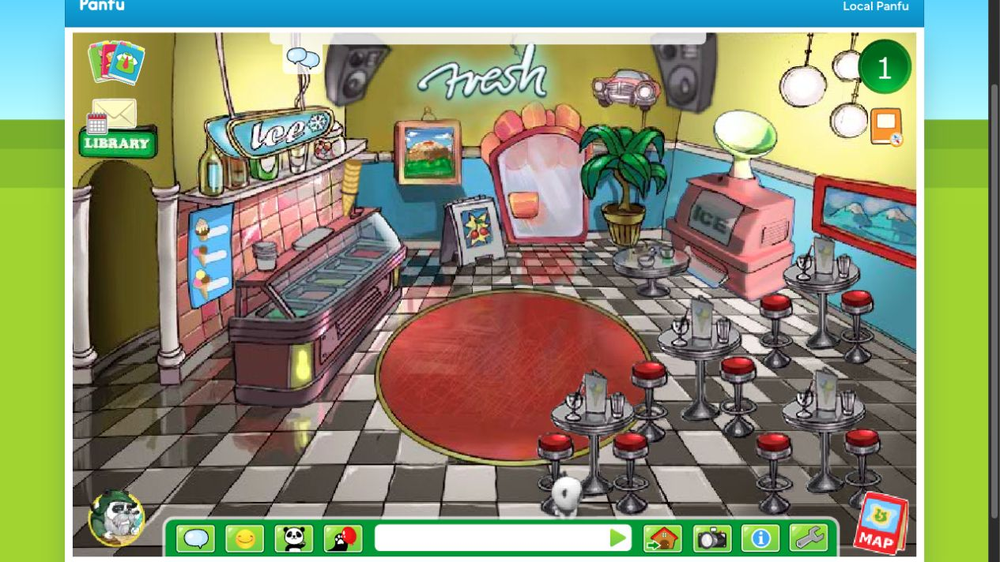

# Panfu

Lokalna rekonstrukcja Panfu uruchamiana bez zależności od produkcyjnego `panfu.me`.
Projekt łączy nowoczesny frontend Laravel + Inertia + Vue + TypeScript z lokalnym
klientem Flash uruchamianym przez Ruffle, natywną bramą AMF Laravela i lokalnym
gameserverem.



## Co tu działa

- Strona główna, logowanie, rejestracja i konto są budowane w Laravelu, Inertii i Vue.
- Gra uruchamia się od razu w przeglądarce przez Ruffle, bez osobnej aplikacji desktopowej.
- Assety Flash są trzymane lokalnie w `public/vendor/openpanfu`.
- Backend gry używa jednej bazy MySQL projektu Laravel.
- Gameserver Javy działa lokalnie, a `socket-proxy` udostępnia mu WebSocket dla Ruffle.
- phpMyAdmin jest dostępny na osobnym porcie do szybkiego podejrzenia bazy.





## Szybki start po restarcie laptopa

Najczęstszy scenariusz: Docker Desktop był wyłączony, a repo jest już skonfigurowane.

```bash
cd ~/Documents/Panfu
docker compose up -d
docker compose ps
```

Potem otwórz:

- Aplikacja: http://127.0.0.1:8080
- Gra: http://127.0.0.1:8080/play
- phpMyAdmin: http://127.0.0.1:19999
- Mailpit: http://127.0.0.1:18025

Jeżeli `/play` przekierowuje do logowania, zaloguj się albo załóż konto przez
`/register`. Po zalogowaniu kliknij `Graj`, wybierz `Local Panfu` i klient gry
powinien wejść do świata.

## Pierwsze uruchomienie od zera

Wymagane lokalnie:

- Docker Desktop
- Composer, jeżeli nie ma jeszcze katalogu `vendor`
- Node/npm, jeżeli chcesz budować assety poza kontenerem

Kroki:

```bash
cd ~/Documents/Panfu
cp .env.example .env
composer install
npm install
npm run build
docker compose up -d --build
docker compose exec -T laravel.test php artisan key:generate
docker compose exec -T laravel.test php artisan migrate --seed
```

Jeżeli `.env` już istnieje, nie nadpisuj go bez potrzeby. Po zmianach w `.env`
wyczyść cache konfiguracji:

```bash
docker compose exec -T laravel.test php artisan optimize:clear
```

## Najważniejsze serwisy

| Serwis | Do czego służy | Port lokalny |
| --- | --- | --- |
| `laravel.test` | Laravel, Inertia, Vue, endpoint AMF i publiczne assety Flash | `8080` |
| `mysql` | Główna baza projektu | `3306` |
| `phpmyadmin` | UI do MySQL | `19999` |
| `gameserver` | Lokalny serwer gry w Javie | wewnętrzny `9595` |
| `socket-proxy` | WebSocket -> TCP dla Ruffle | `19596` |
| `redis` | Cache/kolejki pomocnicze | `6380` |
| `mailpit` | Podgląd maili developerskich | `18025` |
| `selenium` | Przeglądarkowe testy E2E, gdy będą potrzebne | wewnętrzny |

Domyślne dane do bazy w `.env.example`:

```text
DB_DATABASE=panfu
DB_USERNAME=sail
DB_PASSWORD=password
```

## Bezpieczeństwo bramy AMF

- Endpoint przyjmuje wyłącznie `POST` z `Content-Type: application/x-amf` pod
  `/InformationServer/`.
- Rozmiar, liczba wiadomości, liczba elementów i głębokość zagnieżdżenia AMF są
  ograniczone. Limity można dostroić zmiennymi `PANFU_AMF_*` z `.env.example`.
- Dostępne usługi i metody są wpisane na jawną allowlistę. Błędy nie ujawniają
  klientowi treści wyjątków ani szczegółów implementacji.
- Logowanie, rejestracja i cały endpoint mają osobne limity częstotliwości.
- Porty Dockera są domyślnie publikowane tylko na `127.0.0.1`. Zmiana
  `FORWARD_HOST` na `0.0.0.0` udostępnia je w sieci i powinna być świadomą decyzją.
- W środowisku publicznym używaj HTTPS, mocnych wartości `APP_KEY`,
  `DB_PASSWORD` i `PANFU_GAME_SERVER_SECRET_KEY` oraz trwałego współdzielonego
  cache (np. Redis) dla limiterów. Ten plik Compose jest przeznaczony do pracy
  lokalnej, a nie do bezpośredniego wystawiania w internecie.

## Przydatne komendy

Start:

```bash
docker compose up -d
```

Stop bez kasowania danych:

```bash
docker compose stop
```

Logi gry i aplikacji:

```bash
docker compose logs -f laravel.test gameserver socket-proxy
```

Migracje i seedery:

```bash
docker compose exec -T laravel.test php artisan migrate --seed
```

Pełny reset bazy:

```bash
docker compose exec -T laravel.test php artisan migrate:fresh --seed
```

Testy PHP:

```bash
docker compose exec -T laravel.test php artisan test
```

Formatowanie PHP:

```bash
docker compose exec -T laravel.test ./vendor/bin/pint
```

Build frontendu:

```bash
npm run build
```

## Struktura projektu

```text
app/Application/Amf              zgodna z klientem Flash warstwa usług AMF
app/Domain                       logika domenowa gry podzielona funkcjonalnie
app/Infrastructure/Amf           kodek protokołu AMF0/AMF3
app/Infrastructure/GameServer    komunikacja Laravela z gameserverem
game-server/                     lokalny gameserver Java
public/vendor/openpanfu/         lokalne assety Flash klienta i minigier
resources/js/                    Vue + TypeScript + Inertia
tools/socket-proxy.mjs           most WebSocket -> TCP dla Ruffle
tests/Feature/Panfu              testy integracji Panfu
docs/screenshots                 screeny użyte w README
```

## Gdy coś nie działa

1. Sprawdź, czy kontenery stoją:

   ```bash
   docker compose ps
   ```

2. Jeżeli gra zatrzymuje się na wyborze świata albo loadingu, zrestartuj serwer gry:

   ```bash
   docker compose restart gameserver socket-proxy
   ```

3. Jeżeli po zmianie `.env` wartości nie wchodzą w życie:

   ```bash
   docker compose exec -T laravel.test php artisan optimize:clear
   ```

4. Jeżeli w konsoli Ruffle pojawia się `HttpNotOk("Got Not Found", 404, ...)`,
   brakuje lokalnego assetu w `public/vendor/openpanfu`. Dodaj go lokalnie i
   dopisz test w `tests/Feature/Panfu/PanfuAssetAvailabilityTest.php`.

5. Jeżeli baza wygląda pusto po świeżej instalacji, uruchom:

   ```bash
   docker compose exec -T laravel.test php artisan migrate --seed
   ```

## Ważne założenie

Docelowo gra ma działać samodzielnie lokalnie. Produkcyjne `panfu.me` może służyć
do porównywania zachowania i odzyskiwania brakujących assetów, ale lokalny runtime
nie powinien wymagać aktywnej produkcji.
