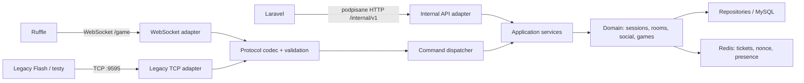

# Plan migracji Game Servera do Spring Boot

Status: plan techniczny, bez rozpoczętej implementacji  
Branch: `codex/spring-boot-game-server-plan`  
Data audytu: 2026-08-19

## 1. Cel

Celem jest zastąpienie obecnego Game Servera w Javie nową, utrzymywalną aplikacją Spring Boot bez zmiany zachowania klienta Flash/Ruffle i bez jednorazowego, ryzykownego przełączenia całego ruchu.

Nowy serwer ma:

- zachować zgodność istniejącego protokołu Panfu;
- bezpośrednio udostępniać WebSocket dla Ruffle, dzięki czemu `tools/socket-proxy.mjs` i kontener `socket-proxy` staną się zbędne;
- rozdzielić transport, logikę gry, sesje i dostęp do danych;
- traktować serwer jako źródło prawdy dla nagród, uprawnień i stanu rozgrywki;
- mieć testy kontraktowe, integracyjne, bezpieczeństwa i obciążeniowe;
- pozwalać na równoległe uruchomienie starego i nowego silnika oraz szybki rollback;
- pozostawić Laravel jako właściciela Information Servera i migracji wspólnej bazy podczas pierwszej wersji migracji.

Nie jest celem przepisywanie Information Servera ponownie ani tworzenie wielu mikroserwisów. Pierwsza wersja ma być jednym modularnym procesem Spring Boot.

## 2. Stan obecny potwierdzony w repozytorium

### Technologia i uruchamianie

- Java 8, Maven i ręcznie składany fat JAR.
- Netty `4.1.26.Final` jako surowy serwer TCP.
- HikariCP `3.2.0`, MySQL Connector/J `8.0.33` i ręczny JDBC.
- SLF4J Simple `1.6.1`, Commons Lang `2.6`, JUnit 4.
- 65 plików produkcyjnych Java i około 3814 linii kodu.
- 25 głównych handlerów `CMD_*` oraz 5 handlerów P2P.
- Jeden proces może uruchamiać kilka wpisów z tabeli `gameservers`, każdy na własnym porcie TCP.
- Ruffle nie łączy się bezpośrednio z Javą. Kontener Node `socket-proxy` tłumaczy WebSocket na TCP (`9596 -> 9595`).
- Laravel wysyła komendy wewnętrzne do Javy przez TCP jako pakiet `900;<secret>;<command>;...|`.

### Aktualny protokół

- Pakiet ma nagłówek liczbowy i parametry rozdzielone średnikiem.
- Pakiety kończą się `|`; dekoder toleruje także `>` dla żądania polityki Flash.
- Transport przesyła tekst/bajty, a Node opakowuje odpowiedzi TCP w binarne ramki WebSocket.
- Dozwolone przed logowaniem są `CMD_LOGIN`, `CMD_GET_SALT` i `CMD_INFOMESSAGE`.
- Obsługiwane obszary obejmują logowanie, pokoje i domy, ruch, czat, avatar/P2P, wspólne przedmioty oraz dwie gry multiplayer.

### Aktualny poziom testów

Po zmianach na `main`:

- Laravel: 166 testów, 3312 asercji, 85,54% pokrycia linii;
- Java: 29 testów, 14,34% pokrycia linii i 9,68% gałęzi;
- klasy protokołu objęte testami: `PanfuPacket`, `GameServerFrameDecoder`, `SessionManager`;
- istnieją testy części zachowania pokojów, avatara i naliczania monet.

Niskie pokrycie całej Javy jest jednym z powodów, dla których migracja musi najpierw utrwalić zachowanie starego serwera w testach kontraktowych.

## 3. Najważniejsze decyzje architektoniczne

### 3.1 Stos docelowy

Na dzień audytu zalecany punkt startowy to:

- Java 21 LTS;
- Spring Boot 4.1.0;
- Gradle 9.6.1, Kotlin DSL i zawsze wersjonowany Gradle Wrapper;
- Spring WebFlux na Reactor Netty dla HTTP i WebSocket;
- Reactor Netty `TcpServer` jako tymczasowy adapter zgodności z surowym TCP;
- Spring Data JDBC zamiast JPA w pierwszym wydaniu;
- MySQL 8.4 i HikariCP zarządzany przez Spring Boot;
- Redis dla jednorazowych ticketów, nonce, rate limitów i koordynacji sesji między instancjami;
- Flyway wyłącznie wtedy, gdy własność migracji zostanie formalnie przeniesiona z Laravel; wcześniej `ddl-auto`/automatyczne DDL jest wyłączone;
- Micrometer, Actuator, Prometheus i strukturalne logi JSON;
- JUnit 5, AssertJ, Mockito, Testcontainers, jqwik, ArchUnit i JaCoCo;
- OWASP Dependency-Check lub OSV Scanner, SpotBugs oraz Spotless/Checkstyle w CI.

Spring Boot 4.1 wymaga co najmniej Javy 17 i wspiera Gradle 8.14+ oraz 9.x. Wybrane Java 21 i Gradle 9.6.1 są celowo konserwatywną bazą. Przed rozpoczęciem implementacji należy zatwierdzić je w ADR i ponownie sprawdzić dostępne poprawki bezpieczeństwa.

Źródła:

- [Spring Boot — System Requirements](https://docs.spring.io/spring-boot/system-requirements.html)
- [Spring Boot — stabilne wydania](https://docs.spring.io/spring-boot/spring-projects.html)
- [Gradle — wydania](https://gradle.org/releases/)

### 3.2 Jeden modularny serwer, nie zestaw mikroserwisów

Nowy Game Server pozostaje jednym wdrażanym artefaktem. Granice między modułami są pilnowane pakietami, interfejsami i testami ArchUnit. Podział na osobne usługi sieciowe byłby uzasadniony dopiero przez niezależne skalowanie albo odmienną własność danych, których dziś nie ma.

### 3.3 Jeden rdzeń protokołu, kilka transportów

WebSocket i TCP nie mogą zawierać osobnej logiki gry. Oba adaptery dekodują wejście do tego samego modelu `IncomingPacket`, przekazują je do jednego dispatchera, a odpowiedź `OutgoingPacket` kodują zgodnie z kontraktem klienta.



### 3.4 Spring Data JDBC zamiast rozbudowanego ORM

Obecny model jest prosty i współdzielony z Laravel. Spring Data JDBC daje repozytoria, mapowanie i transakcje bez ukrytego lazy loadingu i rozbudowanego cyklu życia encji JPA. Jeśli później pojawią się agregaty wymagające JPA, decyzję należy podjąć osobnym ADR.

### 3.5 Lombok tylko pomocniczo

- Preferować rekordy Javy dla niezmiennych pakietów, identyfikatorów i DTO.
- Lombok może obsługiwać konstruktor/logowanie/builder tam, gdzie rekord nie pasuje.
- Nie używać `@Data` na encjach, sesjach ani obiektach zawierających sekrety.
- Nie generować automatycznie `equals`, `hashCode` i `toString` dla obiektów połączeń lub dużych grafów.

### 3.6 Własność schematu bazy

W pierwszym wydaniu Laravel pozostaje jedynym właścicielem migracji bazy. Spring:

- odczytuje i zapisuje tylko jawnie wskazane tabele/kolumny;
- nie uruchamia Hibernate DDL ani własnych migracji współdzielonego schematu;
- ma test zgodności schematu uruchamiany po migracjach Laravel;
- otrzymuje konto DB z minimalnymi uprawnieniami, bez `CREATE`, `DROP`, `ALTER` i dostępu do niepotrzebnych tabel.

Przeniesienie własności konkretnych tabel do Flyway jest możliwe później, ale nigdy nie mogą istnieć dwaj właściciele tej samej tabeli.

## 4. Proponowany układ plików

W okresie migracji nowa aplikacja powinna powstać obok starej jako `game-server-next/`. Po pełnym przełączeniu i usunięciu starego kodu katalog zostanie nazwany `game-server/`.

```text
game-server-next/
├── build.gradle.kts
├── settings.gradle.kts
├── gradlew
├── gradlew.bat
├── gradle/wrapper/
├── src/main/java/com/panfu/gameserver/
│   ├── GameServerApplication.java
│   ├── config/
│   │   ├── GameServerProperties.java
│   │   ├── NetworkConfiguration.java
│   │   ├── SecurityConfiguration.java
│   │   └── ObservabilityConfiguration.java
│   ├── protocol/
│   │   ├── model/IncomingPacket.java
│   │   ├── model/OutgoingPacket.java
│   │   ├── codec/PacketDecoder.java
│   │   ├── codec/PacketEncoder.java
│   │   ├── validation/PacketSchema.java
│   │   └── dispatch/CommandDispatcher.java
│   ├── transport/
│   │   ├── websocket/GameWebSocketHandler.java
│   │   ├── websocket/GameWebSocketConfiguration.java
│   │   ├── tcp/LegacyTcpServer.java
│   │   └── internal/InternalEventController.java
│   ├── application/
│   │   ├── session/
│   │   ├── room/
│   │   ├── social/
│   │   ├── avatar/
│   │   └── minigame/
│   ├── domain/
│   │   ├── player/
│   │   ├── session/
│   │   ├── room/
│   │   ├── social/
│   │   └── minigame/
│   ├── persistence/
│   │   ├── player/
│   │   ├── server/
│   │   └── reward/
│   ├── integration/
│   │   └── laravel/
│   ├── security/
│   │   ├── ticket/
│   │   ├── ratelimit/
│   │   └── internalapi/
│   └── observability/
├── src/main/resources/
│   ├── application.yml
│   ├── application-local.yml
│   └── logback-spring.xml
├── src/test/java/
├── src/test/resources/protocol-fixtures/
└── README.md
```

Interfejsy powinny wyznaczać rzeczywiste granice, np. `PlayerRepository`, `TicketVerifier`, `SessionRegistry`, `RewardPolicy`, `OutboundConnection`. Nie należy automatycznie tworzyć par `XService`/`XServiceImpl`, jeśli istnieje tylko jedna prosta implementacja i nie ma granicy architektonicznej.

## 5. Rejestr ryzyk i plan napraw bezpieczeństwa

Priorytet P0 blokuje produkcyjne przełączenie. P1 musi być zamknięty przed usunięciem starego serwera. P2 może być realizowany po stabilnym cutoverze, jeśli ma zaakceptowane obejście.

| Priorytet | Obecny problem | Dowód w kodzie | Naprawa docelowa | Wymagany test |
|---|---|---|---|---|
| P0 | Wynik minigry i `gameId` pochodzą od klienta | `CMD_QUIT_GAME` przekazuje `points` wprost do `MinigameRewardDAO` | Serwerowa sesja rundy, dozwolony wynik/maksimum/czas, nonce rundy, idempotentne naliczenie i transakcja | Powtórzenie pakietu, ujemny/ogromny wynik, obca gra, brak rundy, równoległe zakończenia |
| P0 | Wewnętrzny kanał Laravel -> Java używa stałego sekretu w zwykłym TCP | `TcpGameServerClient`, `CMD_INFOMESSAGE` | Prywatne HTTP API z mTLS lub HMAC: timestamp, nonce, podpis całego body, krótki TTL, ochrona replay i allowlista komend | Zły podpis, stary timestamp, ponowiony nonce, zmienione body, brak uprawnienia |
| P0 | Publiczny WebSocket proxy nie sprawdza Origin, ścieżki, auth ani rozmiaru ramki | `tools/socket-proxy.mjs` | WebSocket w Javie z allowlistą Origin/Host, limitem handshake, ramki, wiadomości i czasu bezczynności; auth przed utworzeniem sesji | Obcy Origin, oversize, fragment flood, slow client, brak ticketu |
| P0 | Ticket logowania jest liczbą i nie ma atomowego consume | `issueGameTicket`, `CMD_LOGIN`, osobne `SELECT` i `UPDATE NULL` | Losowy 256-bitowy ticket, hash w storage, TTL, jednorazowe atomowe `GETDEL`/transakcja oraz powiązanie z graczem i serwerem | Replay, wygaśnięcie, równoległe logowania, ticket innego serwera |
| P0 | Brak centralnej autoryzacji komend według stanu sesji | ręczny warunek w `User.handlePacket` | Maszyna stanów `CONNECTED -> AUTHENTICATED -> IN_ROOM -> IN_GAME`; deklaratywne wymagania przy każdym handlerze | Każda komenda w każdym niedozwolonym stanie |
| P0 | Parametry pakietów są pobierane bez pełnego schematu | `readInt/readString` w handlerach | Schemat: liczba, typ, zakres, długość i enum parametrów przed wykonaniem handlera; bez wyjątków i częściowych zmian | Fuzzing, brakujące/nadmiarowe pola, overflow, Unicode, delimitery |
| P1 | Polityka Flash pozwala każdej domenie na porty `1-65535` | `GameServerHandler` | Usunąć, jeśli wspierany jest wyłącznie Ruffle; w przeciwnym razie osobny minimalny policy server z allowlistą domen i portu | Snapshot XML i odmowa obcej domeny/portu |
| P1 | Ruch i teleportacja ufają współrzędnym klienta | `CMD_MOVE`, `CMD_FORCE_COORD`, `CMD_JOIN_ROOM` | Zakres mapy, dozwolony typ ruchu, prędkość/czas, przejścia między pokojami i osobne uprawnienie teleportu | NaN/overflow nie dotyczy int, skrajne int, teleport, ściana, niedozwolony pokój |
| P1 | P2P pozwala wskazać odbiorcę/globalny zakres bez spójnej kontroli relacji | `sendForReceiver`, `CMD_PLAYER_TO_PLAYER` | Typowany `Audience`, domyślnie bieżący pokój, jawne uprawnienia globalne, walidacja obecności i relacji | Obcy pokój, nieistniejący gracz, global broadcast zwykłego gracza |
| P1 | Zaproszenia do gry i wiadomości multiplayer ufają identyfikatorom klienta | `CMD_ACTION`, `FourBoom`, `RockPaperScissors` | Serwerowe `MatchId`, członkostwo, kolejność tur i lista dopuszczonych akcji; ignorowanie sender ID z payloadu | Podszycie, wiadomość bez meczu, obcy partner, zła kolejność |
| P1 | Chat używa wspólnego licznika ostrzeżeń z akcjami i regexowego czyszczenia HTML | `CMD_CHAT`, `CMD_SAFE_CHAT`, `User.spamWarning` | Oddzielne token buckets, limity bajtów i znaków, normalizacja Unicode, bezpieczny słownik/format komunikatów, audyt moderacji | Flood, puste wiadomości, tag-only, długi Unicode, mieszane kanały |
| P1 | Nieograniczona lista blokowanych IP jest lokalna i niesynchronizowana | `CMD_INFOMESSAGE.blockList` | Usunąć wraz ze starym kanałem; rate limit z TTL i metryką, bez trwałego banowania całego NAT | TTL, limit pamięci, wiele instancji, poprawne IP za proxy |
| P1 | Połączenie z DB jawnie wyłącza TLS | `Database.connect()` ustawia `useSSL=false` | Konfigurowalny TLS, w produkcji `VERIFY_IDENTITY`, sekrety z secret store i najmniejsze uprawnienia | Start odrzucony przy niebezpiecznej konfiguracji produkcyjnej |
| P1 | Dynamicznie ładowany dowolny JAR ma pełne uprawnienia procesu | `PluginLoader` | Nie przenosić mechanizmu 1:1; funkcje pluginów włączyć jako moduły/feature flags. Jeśli pluginy pozostaną, tylko podpisane artefakty z allowlisty | Niepodpisany/zmieniony JAR i nieznany plugin odrzucone |
| P1 | Logi mogą zawierać całe pakiety, w tym ticket/sekret | `Logger.debug`, pakiet 900 i logowanie | Maskowanie pól, brak surowego payloadu logowania, korelacja przez connection ID | Snapshot logów bez ticketów, sekretów i danych osobowych |
| P1 | Brak limitu liczby połączeń i per-IP handshake/login | pipeline Netty | Limity globalne, per-IP i per-account; timeout handshake/login/idle; kontrolowana kolejka zapisu | Connection flood, login brute force, wolny odbiorca |
| P2 | Statyczny globalny stan utrudnia izolację i wieloinstancyjność | `GameServer`, `Handler`, `PluginManager` | Beany Spring o jawnych cyklach życia; sesje w pamięci instancji, presence/tickety w Redis | Dwie instancje, restart jednej, brak podwójnej sesji |
| P2 | `printStackTrace`, ręczne zamykanie JDBC i możliwe NPE maskują awarie | DAO i handlery | Structured logging, try-with-resources/Spring JDBC, typowane błędy, error boundary transportu | Awaria DB/handlera nie kończy event loop ani innych sesji |

Każde ryzyko P0/P1 musi mieć właściciela, test regresyjny i link do commita zamykającego problem. Sam wzrost coverage nie oznacza zamknięcia ryzyka.

## 6. Bezpieczne naliczanie monet

To osobny strumień prac, ponieważ samo ograniczenie `maxCoinsPerRound` nie zabezpiecza przed wielokrotnym wysłaniem poprawnego maksimum.

### Model docelowy

1. Wejście do minigry tworzy `GameRound` z losowym identyfikatorem, graczem, `gameId`, czasem rozpoczęcia i stanem `STARTED`.
2. Reguły gry określają maksymalny wynik, tempo jego przyrostu, czas rundy i przelicznik nagrody.
3. Zakończenie rundy przyjmuje wyłącznie zdarzenia potrzebne do weryfikacji, nie dowolną liczbę monet.
4. Serwer wylicza wynik możliwy do uznania oraz nagrodę.
5. Zapis wyniku, naliczenie monet i oznaczenie rundy `REWARDED` następują w jednej transakcji.
6. Unikalny klucz `round_id` w ledgerze nagród uniemożliwia podwójne naliczenie.
7. Podejrzane wyniki są odrzucane i audytowane, bez ujawniania klientowi szczegółów reguł antycheat.

### Minimalny wariant kompatybilności

Jeśli nie da się od razu odtworzyć mechaniki każdej SWF:

- utrzymać payload klienta, ale wymagać aktywnej rundy utworzonej przez serwer;
- wprowadzić limit punktów, czasu i częstotliwości per `gameId`;
- naliczać tylko raz na rundę;
- oddzielić tabelę ledger od salda użytkownika;
- wdrożyć alerty dla odrzuceń i anomalii.

## 7. Kontrakt Laravel <-> Game Server

### Logowanie gracza

1. Laravel po poprawnym logowaniu wydaje jednorazowy, losowy ticket z TTL 30-60 sekund.
2. Ticket jest przypisany do `playerId`, wybranego `serverId` i opcjonalnie fingerprintu sesji.
3. Ruffle otwiera WebSocket i wysyła istniejący pakiet logowania zgodnie z kontraktem kompatybilności.
4. Spring atomowo konsumuje ticket. Replay zawsze kończy się odmową.
5. Po zestawieniu sesji Spring publikuje presence i odświeża heartbeat.
6. Rozłączenie/timeout usuwa presence idempotentnie.

Jeśli format starego pakietu wymaga int32, w fazie kompatybilności Laravel mapuje krótki int32 do hasha właściwego ticketu w Redis. Docelowy protokół v2 powinien przyjmować bezpośrednio token kryptograficzny.

### Komendy administracyjne i społeczne

Surowy `CMD_INFOMESSAGE` zastępuje wewnętrzne API, np.:

- `POST /internal/v1/players/{id}/kick`;
- `POST /internal/v1/players/{id}/buddy-status`;
- `GET /internal/v1/health/connection`.

Wymagania:

- endpoint niedostępny z publicznej sieci;
- mTLS między kontenerami lub HMAC-SHA256 nad metodą, ścieżką, timestampem, nonce i hashem body;
- maksymalny dryf czasu;
- atomowy magazyn nonce z TTL;
- jawna allowlista operacji i walidowane DTO;
- idempotency key dla operacji ponawianych;
- timeout, retry wyłącznie dla idempotentnych operacji i circuit breaker po stronie Laravel;
- audit log bez sekretów.

## 8. Strategia kompatybilności protokołu

### Golden master

Przed portowaniem każdego handlera należy utrwalić:

- przykładowe wejścia surowe;
- dokładne bajty odpowiedzi;
- odbiorców odpowiedzi: sender, pokój, pokój bez sendera, konkretny gracz, cały serwer;
- zmianę stanu sesji i bazy;
- zachowanie dla brakujących, nadmiarowych i błędnych parametrów;
- zachowanie przy rozłączeniu i ponownym połączeniu.

Fixture nie może opierać się wyłącznie na kodzie starego serwera. Co najmniej najważniejsze scenariusze należy nagrać z uruchomionej gry Ruffle i opisać znaczeniem biznesowym.

### Warstwa protokołu

- `PacketDecoder` jest bezstanowy i nie zna sesji ani DB.
- Każdy command ma deklaratywny `PacketSchema`.
- Kodowanie zachowuje dokładne separatory, kolejność i reprezentację wartości starego klienta.
- Nieznany nagłówek daje kontrolowaną metrykę/odpowiedź, nie stack trace.
- Jeden błąd pakietu nie może uszkodzić event loop ani innych sesji.
- Limit pełnej wiadomości obowiązuje także po złożeniu wielu ramek WebSocket.
- Binary i text WebSocket są jawnie obsłużone zgodnie z obserwowanym zachowaniem Ruffle.

### Macierz portowania

Dla każdego z 25 handlerów głównych i 5 P2P powstaje wpis:

| Pole | Wymagana informacja |
|---|---|
| Command/header | numer i nazwa |
| Stan wejściowy | connected/authenticated/in-room/in-game |
| Parametry | typ, zakres, maksymalny rozmiar, opcjonalność |
| Autoryzacja | kto i w jakiej sytuacji może wywołać |
| Mutacje | sesja, pokój, DB, Redis |
| Odbiorcy | sender/room/user/server |
| Odpowiedzi | dokładny fixture bajtowy |
| Błędy | odpowiedź, log i decyzja o rozłączeniu |
| Testy | unit, contract, integration, abuse |
| Status | not started/in progress/parity/approved |

## 9. Etapy realizacji

Każdy etap kończy się działającym, testowalnym artefaktem. Następny etap nie może usuwać starej ścieżki, dopóki jego kryteria akceptacji nie są spełnione.

### Etap 0 — zamrożenie kontraktu i obserwowalność starego serwera

Zakres:

- spisać wszystkie handlery, nagłówki i odbiorców;
- dodać recorder/proxy testowy zapisujący zanonimizowane sesje protokołu;
- przygotować fixtures dla logowania, pokoju, domu, ruchu, czatu, avatara, P2P i minigier;
- dodać testy integracyjne starej Javy z MySQL przez Testcontainers;
- ustalić bazowe metryki: połączenia, login success/fail, pakiety/s, błędy, opóźnienie, rozłączenia;
- opisać obecne świadome odstępstwa/bugi, aby test golden master nie utrwalał podatności jako wymagania.

Akceptacja:

- 100% zarejestrowanych handlerów ma po co najmniej jednym scenariuszu happy path;
- wszystkie P0 mają test pokazujący podatne zachowanie lub bezpieczny test oczekiwanego zachowania oznaczony jako pending;
- fixtures nie zawierają danych osobowych ani sekretów.

Rollback: brak zmian w ruchu produkcyjnym.

### Etap 1 — szkielet Spring Boot

Zakres:

- utworzyć `game-server-next` z Gradle Wrapper i Kotlin DSL;
- dodać profile `local`, `test`, `production` oraz walidowane `@ConfigurationProperties`;
- skonfigurować WebFlux/Reactor Netty, Actuator, Micrometer i JSON logging;
- uruchomić MySQL i Redis w Testcontainers;
- dodać health/readiness/liveness bez ujawniania sekretów;
- dodać CI: build, test, coverage, formatter, statyczna analiza, dependency scan i obraz kontenera;
- dodać ArchUnit pilnujący zależności między pakietami.

Akceptacja:

- `./gradlew clean check` działa lokalnie i w CI;
- obraz uruchamia się jako nie-root na read-only filesystem;
- aplikacja nie startuje przy brakującym sekrecie, niebezpiecznej konfiguracji produkcyjnej lub niezgodnym schemacie.

Rollback: usunięcie nowego, niepodłączonego kontenera.

### Etap 2 — codec i dwa transporty

Zakres:

- napisać typowany codec kompatybilny z `PanfuPacket`;
- uruchomić bezpośredni WebSocket `/game` dla Ruffle;
- uruchomić adapter legacy TCP na osobnym, wewnętrznym porcie;
- zaimplementować limity ramek/wiadomości, idle timeout, backpressure i kontrolowane zamykanie;
- dodać walidację Origin/Host i handshake;
- obsłużyć ping/pong/close oraz fragmentację WebSocket;
- odtworzyć zachowanie binary frames obecnego proxy.

Akceptacja:

- testy golden master dają te same bajty dla TCP i WebSocket;
- Ruffle łączy się bez Node proxy w środowisku testowym;
- fuzz test nie wywołuje nieobsłużonego wyjątku ani wzrostu pamięci;
- 90% linii i 85% gałęzi w `protocol` i `transport`.

Rollback: Ruffle nadal wskazuje `socket-proxy`, nowy port nie jest publikowany.

### Etap 3 — tożsamość, sesje i presence

Zakres:

- wdrożyć stan połączenia i centralną politykę komend;
- wprowadzić atomowo konsumowany ticket z TTL;
- obsłużyć duplikat sesji według jawnej reguły;
- rozdzielić connection ID, player ID i server ID;
- heartbeat/presence w Redis z TTL;
- idempotentny disconnect i cleanup po utracie sieci/restartcie;
- aktualizować `current_gameserver` oraz player count bez wyścigów.

Akceptacja:

- ticketu nie da się użyć ponownie ani na innym serwerze;
- dwie równoległe próby logowania dają dokładnie jedną aktywną sesję;
- restart procesu usuwa fałszywy presence po TTL;
- testy obciążeniowe potwierdzają założony limit równoległych połączeń.

Rollback: logowanie nadal trafia do starego serwera; nowe tickety są zgodne z warstwą przejściową.

### Etap 4 — pokoje, domy i ruch

Zakres:

- przenieść join/leave/change room/home/subroom;
- zaimplementować atomowe członkostwo w pokoju i spójny broadcast;
- walidować istnienie pokoju, prawo wejścia do domu i dozwolone przejścia;
- walidować współrzędne, prędkość i typ ruchu;
- odtworzyć bootstrap avatara i stan wspólnych przedmiotów;
- zabezpieczyć zakres indeksów shared items.

Akceptacja:

- parity fixtures dla wszystkich wariantów pokojów;
- brak wiadomości po opuszczeniu pokoju;
- gracz nie nadaje do obcego pokoju ani nie zajmuje niedozwolonego item slotu;
- scenariusze disconnect w trakcie zmiany pokoju nie zostawiają ghost session.

Rollback: routing gracza przełącza cały spójny shard/serwer, nie pojedynczą komendę mutującą.

### Etap 5 — chat, avatar, P2P i social

Zakres:

- oddzielne rate limity per kanał i gracz/IP;
- walidacja/normalizacja wiadomości i pól avatara;
- typowani odbiorcy oraz uprawnienia broadcastów;
- bezpieczne komendy moderatora zamiast niejawnych uprawnień w tekście;
- integracja buddy status z nowym internal API;
- audyt i metryki moderacji.

Akceptacja:

- zwykły gracz nie wyśle globalnego/eventowego komunikatu;
- payload nie może wstrzyknąć separatora ani sfałszować user ID;
- limity nie blokują całego NAT bez powodu;
- wynik testów golden master pozostaje zgodny dla poprawnych wiadomości.

### Etap 6 — minigry i nagrody

Zakres:

- serwerowe rundy, match ID i członkostwo;
- kolejka multiplayer bez wyścigów;
- walidacja kolejności/dozwolonych akcji;
- reward ledger, idempotencja i transakcje;
- per-game `RewardPolicy` oraz limity anomalii;
- dashboard odrzuconych/podejrzanych nagród.

Akceptacja:

- żaden bezpośredni parametr klienta nie jest kwotą dopisywaną do salda;
- ponowienie i równoległość nie zwiększają nagrody;
- awaria między ledgerem a saldem nie powoduje częściowego zapisu;
- istnieją testy abuse dla każdej obsługiwanej minigry.

### Etap 7 — bezpieczna integracja wewnętrzna

Zakres:

- wdrożyć podpisane/mTLS internal API;
- przełączyć Laravel `GameServerClient` z TCP na nowy adapter HTTP;
- dodać retry/circuit breaker i idempotency;
- usunąć dostęp do `CMD_INFOMESSAGE` przed logowaniem;
- zakończyć dystrybucję stałego `secret_key` przez tabelę `gameservers`.

Akceptacja:

- stary pakiet 900 jest domyślnie wyłączony;
- wszystkie trzy obecne operacje mają testy kontraktowe Laravel <-> Spring;
- replay, spoofing i zmiana body są odrzucane;
- awaria Game Servera nie blokuje requestu Laravel dłużej niż ustalony timeout.

Rollback: feature flag przywraca stary adapter TCP tylko na czas incydentu i tylko w prywatnej sieci.

### Etap 8 — shadow, canary i cutover

Zakres:

- odtwarzać zanonimizowany ruch w nowym serwerze bez wykonywania mutacji;
- porównywać odpowiedzi, odbiorców i zmiany stanu;
- uruchomić osobny testowy game server/shard na nowym silniku;
- następnie kierować 1%, 10%, 50% i 100% sesji całymi sesjami;
- nie rozdzielać jednej sesji między stary i nowy silnik;
- automatycznie cofać przy przekroczeniu error rate, latency lub rozbieżności protokołu.

Warunki przejścia między progami:

- brak otwartych P0;
- brak nowej regresji krytycznej przez ustalone okno obserwacji;
- login success rate i disconnect rate nie gorsze od baseline;
- p95/p99 opóźnienia w budżecie;
- brak podwójnych nagród i ghost sessions;
- zatwierdzony runbook rollbacku.

### Etap 9 — usunięcie starego serwera i Node proxy

Zakres:

- usunąć `socket-proxy` z `compose.yaml`, zmienne proxy i `tools/socket-proxy.mjs`;
- usunąć Maven/Java 8 i stary kod dopiero po okresie stabilizacji;
- zmienić nazwę `game-server-next` na `game-server` w osobnym, mechanicznym commicie;
- usunąć legacy TCP/policy server, jeśli nie wspieramy natywnego Flash;
- usunąć stare sekrety z DB i obrócić wszystkie poświadczenia;
- zaktualizować README, diagramy, runbooki i backup/restore;
- zachować tylko niesekretne fixtures i dokumentację protokołu.

Akceptacja:

- w repo i Compose nie ma Node proxy, Java 8 ani starego JAR;
- świeże `docker compose up` uruchamia całość bez ręcznych kroków;
- Ruffle przechodzi pełny smoke test;
- rollback po usunięciu oznacza wdrożenie ostatniego obrazu starej wersji, a nie odzyskiwanie skasowanych plików lokalnych.

## 10. Testy i quality gates

### Poziomy testów

1. **Unit** — codec, walidatory, polityki nagród, maszyna stanów, routing odbiorców.
2. **Property/fuzz** — losowe pakiety, delimitery, Unicode, overflow, fragmentacja i dowolna kolejność zdarzeń.
3. **Contract/golden master** — dokładne bajty starego i nowego serwera oraz kontrakt Laravel -> Spring.
4. **Integration** — MySQL/Redis przez Testcontainers, transakcje, reconnect i awarie zależności.
5. **End-to-end** — prawdziwy Ruffle: login, wejście do pokoju, ruch, chat, avatar, dom i minigra.
6. **Security** — auth replay, authz, injection protokołu, origin, rate limit, secrets/logging i dependency scan.
7. **Load/soak** — połączenia, broadcast dużego pokoju, reconnect storm, wolni konsumenci i wielogodzinny soak.
8. **Resilience** — restart Javy, Redis/MySQL niedostępne, timeout Laravel, częściowy deploy i utrata pakietu.

### Progi

- cała nowa aplikacja: minimum 80% linii i 70% gałęzi;
- `protocol`, `security`, `session`, `reward`: minimum 90% linii i 85% gałęzi;
- wszystkie P0/P1: obowiązkowy test regresyjny niezależnie od coverage;
- mutation testing PIT dla `RewardPolicy`, ticketów i maszyny stanów; wynik ustalony po pierwszym baseline, docelowo minimum 75%;
- zero nowych podatności high/critical bez zaakceptowanego wyjątku z datą wygaśnięcia;
- brak flaky tests — retry w CI nie może być sposobem na ich ukrywanie.

### Testy wydajnościowe przed cutoverem

Scenariusze muszą używać realistycznego rozkładu pokojów, nie tylko pustych socketów:

- równoczesne logowania i reconnect storm;
- duży publiczny pokój z ruchem/chatem;
- wiele małych pokojów/domów;
- broadcast P2P i buddy status;
- matchmaking i kończenie minigier;
- wolny klient powodujący backpressure;
- restart instancji przy aktywnych sesjach.

Budżety liczbowe należy ustalić na podstawie pomiaru obecnego ruchu i spodziewanego zapasu, a nie arbitralnej liczby.

## 11. Obserwowalność i eksploatacja

### Metryki

- aktywne/otwierane/zamykane połączenia według transportu i server ID;
- handshake/login success/failure oraz powody odmowy;
- pakiety według commandu, wynik handlera i czas wykonania;
- rozmiary ramek/wiadomości oraz odrzucenia limitów;
- liczba użytkowników/pokój, broadcast fan-out i kolejka zapisu;
- DB/Redis latency, pool saturation i circuit breaker;
- utworzone/zakończone/odrzucone rundy oraz naliczone monety;
- rate-limit hits, auth replay, invalid origin i invalid packet;
- JVM heap, GC, event-loop lag i liczba wątków.

Nie wolno używać `playerId`, IP, ticketu ani treści chatu jako etykiet Prometheusa o wysokiej kardynalności.

### Logi i tracing

- JSON z `connectionId`, `requestId`, `serverId`, commandem i wynikiem;
- maskowanie ticketów, sekretów, e-maili i payloadów logowania;
- próbkowanie normalnego ruchu, pełne logowanie zdarzeń bezpieczeństwa bez poufnych danych;
- trace context na wywołaniu Laravel -> Spring;
- dashboard i alerty muszą istnieć przed canary, nie po incydencie.

### Runbooki

- Game Server nie startuje;
- wzrost błędów logowania;
- Redis/MySQL niedostępne;
- reconnect storm;
- ghost sessions/player count;
- podejrzenie exploita monet;
- rotacja poświadczeń;
- canary rollback;
- backup/restore tabel nagród i sesji.

## 12. Docker i konfiguracja

Docelowo Compose zawiera jeden serwis Game Servera zamiast `gameserver` + `socket-proxy`.

Wymagania obrazu:

- wieloetapowy build i przypięty digest obrazu bazowego;
- JVM 21 runtime, użytkownik bez roota;
- read-only root filesystem i osobny tmpfs, jeśli potrzebny;
- brak kompilatora i Gradle w obrazie runtime;
- tylko potrzebne porty, bez publicznego internal API;
- healthcheck korzystający z readiness, nie z samego otwarcia portu;
- limity CPU/pamięci i ustawienia graceful shutdown;
- sekrety przekazywane przez mechanizm sekretów, nie plik w obrazie ani tabelę zwracaną aplikacji;
- konfiguracja `wss://` za reverse proxy w środowisku publicznym.

Proponowane porty podczas migracji:

- `9596` — WebSocket `/game` dla Ruffle;
- `9595` — legacy TCP tylko w sieci wewnętrznej;
- `8080` — internal API/Actuator tylko w sieci wewnętrznej albo osobne management port;
- po usunięciu legacy można uprościć mapowanie, zachowując publiczny URL konfiguracyjny po stronie Laravel.

## 13. Strategia commitów i branchy

- Jeden branch/PR na etap lub mniejszy pionowy fragment działający end-to-end.
- Najpierw test kontraktowy pokazujący zachowanie, następnie implementacja.
- Zmiany protokołu, bazy i infrastruktury w osobnych commitach, jeśli można je wdrożyć niezależnie.
- Każdy PR zawiera: zakres komend, fixtures, ryzyka, metryki, sposób rollbacku i checklistę ręcznego testu Ruffle.
- Żaden PR migracyjny nie usuwa starej ścieżki przed udanym canary.
- Aktualizacja macierzy portowania jest częścią Definition of Done handlera.

## 14. Kolejność backlogu

### Fundament

- [ ] ADR: wersje Java/Spring/Gradle i polityka aktualizacji.
- [ ] ADR: Spring Data JDBC i własność migracji Laravel.
- [ ] ADR: WebSocket + tymczasowy TCP w jednym procesie.
- [ ] ADR: model ticketów i internal API auth.
- [ ] Inwentaryzacja 30 handlerów z macierzą kontraktu.
- [ ] Recorder oraz zanonimizowane fixtures.
- [ ] Szkielet Gradle/Spring Boot i CI.
- [ ] Testcontainers MySQL/Redis.
- [ ] Codec, schema validation i dispatcher.
- [ ] WebSocket, legacy TCP i testy parity.

### Bezpieczeństwo i sesje

- [ ] Origin/Host/size/idle/connection limits.
- [ ] Jednorazowy ticket z TTL i replay protection.
- [ ] Maszyna stanów i centralna authz komend.
- [ ] Session registry/presence i duplicate login policy.
- [ ] Bezpieczne internal API oraz nowy adapter Laravel.
- [ ] Redakcja logów i rotacja sekretów.

### Funkcje gry

- [ ] Pokoje, domy, subroom i broadcast.
- [ ] Ruch i walidacja przejść/współrzędnych.
- [ ] Avatar i shared items.
- [ ] Chat/safe chat/moderacja.
- [ ] P2P/social i typowani odbiorcy.
- [ ] Matchmaking i wiadomości multiplayer.
- [ ] Game rounds, reward policy i ledger.

### Przełączenie

- [ ] Shadow comparison.
- [ ] Testowy shard i pełny smoke Ruffle.
- [ ] Load/soak/resilience tests.
- [ ] Canary 1/10/50/100% z automatycznym rollbackiem.
- [ ] Okres stabilizacji i zamknięcie P0/P1.
- [ ] Usunięcie Node proxy, starej Javy/Mavena i pakietu 900.
- [ ] Finalna rotacja sekretów i aktualizacja dokumentacji.

## 15. Definition of Done całej migracji

Migracja jest zakończona dopiero, gdy:

- Ruffle łączy się bezpośrednio przez bezpieczny WebSocket Javy;
- wszystkie obecnie wspierane komendy mają potwierdzoną zgodność lub świadomie zatwierdzoną zmianę;
- Laravel używa uwierzytelnionego internal API, a nie pakietu 900 po TCP;
- ticket jest jednorazowy, krótko żyjący i odporny na replay;
- nagrody są serwerowo ograniczone, transakcyjne i idempotentne;
- wszystkie P0/P1 są zamknięte testami regresyjnymi;
- spełnione są quality gates, testy Ruffle, load, soak i resilience;
- działają dashboardy, alerty i przećwiczony rollback;
- usunięto `tools/socket-proxy.mjs`, kontener Node oraz stary Java 8/Maven Game Server;
- Compose, README i runbook pozwalają uruchomić i diagnozować system bez wiedzy ukrytej w głowie autora.

## 16. Pierwszy bezpieczny krok implementacyjny

Pierwszy PR implementacyjny nie powinien jeszcze tworzyć handlerów Spring. Powinien dostarczyć macierz protokołu, recorder, fixtures oraz dodatkowe testy integracyjne starego serwera. Dopiero mając ten kontrakt można utworzyć szkielet `game-server-next` i portować pionowo: WebSocket + login + wejście do jednego pokoju + ping. Taki fragment da się uruchomić na osobnym testowym server ID i ocenić bez ryzyka dla pozostałej gry.
